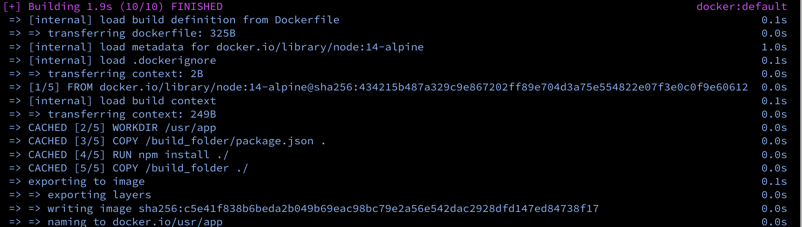
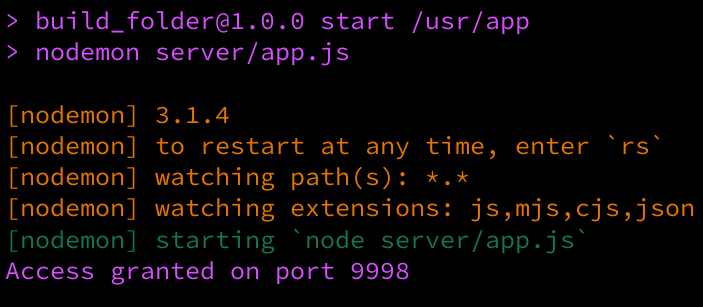

# Deploying an Application inside of a Docker-Container

## Build, & Test Application 
Before sending an application to the container, we must **CREATE the application**

Whichever framework is used, remember to:
1. Build, test and deploy your app locally
2. Ensure that a server and a port exist in your app (index.js, app.js, server.js, etc...)


## Create the Dockerfile
A Dockerfile is a text file with no file extension listed.
The purpose of Dockerfile is to run all the commands needed to run the application.

Examples: 
```
WORKDIR [./dir], COPY [./source] [./destination] ,RUN [npm install ./]
```

**Do you remember making sandwich at home and taking it to work/school to eat?**

In order to preserve the sandwich's state, it would be sanitary to place the item in alluminum foil, paper-bag...or a container!
If the sandwich is not contained, there is a chance that it can get contaminated, break apart, or get lost. 

You've been making your own sandwiches [applications] for years now and already have an idea on:
1. How you decide to contain your sandwich [foil,paper-bag,etc..]
2. Which working-directory of your lunchbox, or container, you decide to store the sandwich in for later extraction.
3. and which build-command you decide to use in order to get all of your packages,ketchup packets, mayo,etc...


```
# Base Image
FROM node:14-alpine

WORKDIR /usr/app
# install dependencies

# copy package.json
COPY /build_folder/package.json .

# run npm -i to spawn node_modules/packages
RUN npm install ./

# copy the rest of the items
COPY /build_folder ./

# Defualt command
CMD ["npm","start"]
```
After viewing ```Dockerfile```, the instructions are read as follows:
1. We are declaring Base Image in line 1. Since we are utilizing an express server, we pull **FROM node:14-alpine**
2. We point WORKDIR (working directory) to the container's file tree. We want our application to be seating under **usr/app** folder.
This is not your local machine. This is the Docker Container's file system.
3. Then we copy package.json file from the **build_folder**
4. run npm packages inside of the working directory
5. copy the rest of the files from your local directory and place into working directory.
6. setup your default command to run the application.


In summary of the Dockerfile, You are importing your local application to a **Docker Container** via the Dockerfile.
 

 ## Build the Container

Once the __Dockerfile__ is setup: 
1. review the Dockerfile again and compare it to your local directory to mitigate any potential mistakes.
2. Build your container with the command: 
```
docker build -t /[username]/[projectname] [local directory]
```
Example:
```
docker build -t /usr/app .
```

A successful build is displayed in the terminal with "0" (zero) errors.
An example can be seen below.
Depending on the size of your project, your container can build from a few seconds to a few minutes.




 ## Run the Container
Run the container using ```docker run``` CMD
Example:
```
docker run -p [public port]:[server port] /[username]/[projectname]
```
Example:
```
docker run -p 6786:9998 /usr/app
```
Running the docker container is synonymous to running the server on your local machine.
Keep in mind, that the output originated from my local **app.js**, server file. 
Port **9888** is mapped from the public port, **6786**.

In reality, we can access the server via **6786** on any browser on the current machine.



- Open the application and DEV


In conclusion,
Running a docker container is good practice when isolating the application from the dependencies. The process can seem like a challenge if the process is not done thoroughly and carefully.

While there is an abundance of ways we can take our Docker Containerization further, remember to:
1. Build & Test the Application 
2. Create the Dockerfile
3. Build the Container
4. Run the Container


